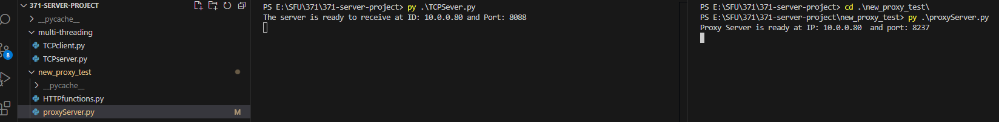
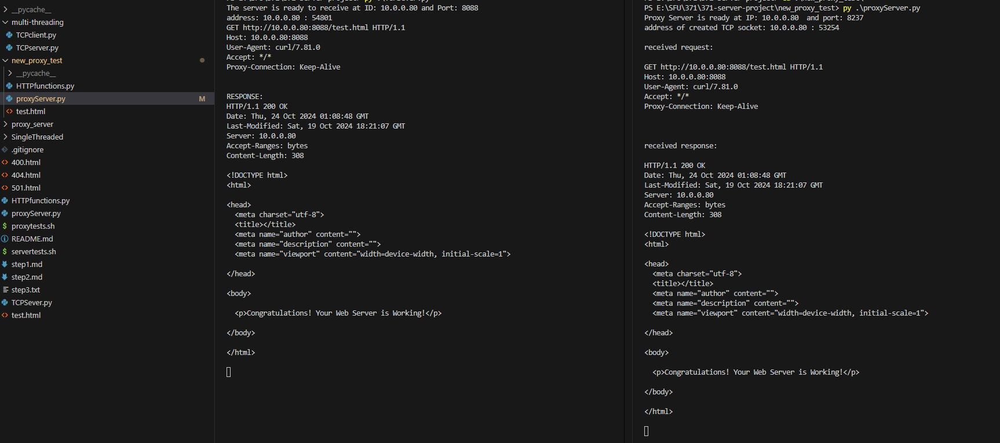
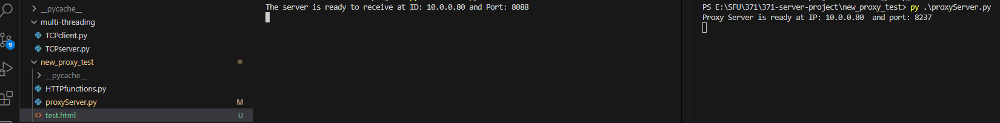
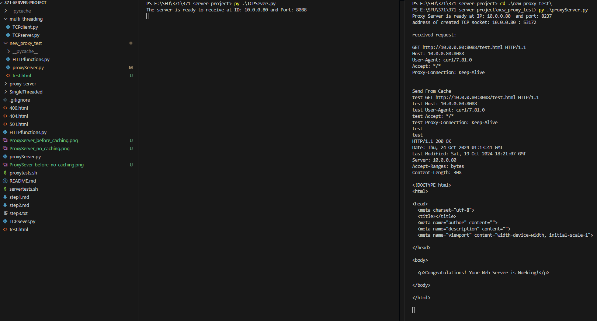

# Step One: Determine Requirements

1. 200	OK
Requirements: 
    a. use GET method
    b. the requested file exists on the server
    c. the protocol is "HTTP/1.1"

Message part: 
    the request line 
    e.g. GET /test.html HTTP/1.1\r\n
    command + url + version

Test HTTP request:
    GET /test.html HTTP/1.1\r\n
    Host: localhost:8088\r\n

2. 304	Not Modified
Requirements: 
        a. there is "If-Modified-Since" message in the header file
        b. the requested file exists on the server
        c. compare the time in the header file and the last modified time from the file
        if the time from the header >= file last modified time, then it is not modified

Message part: 
    in the header file, the line starts with "If-Modified-Since", and with a time

Test HTTP request:
    GET /test.html HTTP/1.1\r\n
    Host: localhost:8088\r\n
    If-Modified-Since: Tue, 14 Oct 2024 10:00:00 GMT\r\n\r\n

3. 400	Bad request
Requirements: 
    a. malformed request syntax (the number of elements in the request line is not 3)
    b. invalid request message framing 
    c. the protocol is not "HTTP/1.1"

Message part: 
    the request line 
    e.g. GET /test.html HTTP/1.1\r\n
    command + url + version

Test HTTP request:
    GET /test.html HTTP/1.0\r\n
    Host: localhost:8088\r\n

4. 404	Not Found
Requirements: 
    the requested file does not exist on the server

Message part: 
    the url in the request line

Test HTTP request:
    GET /notExist.html HTTP/1.1\r\n
    Host: localhost:8088\r\n

5. 501	Not Implemented
Requirements: 
    the method is not GET

Message part: 
    the first element in the request line (command)

Test HTTP request:
    POST /test.html HTTP/1.1\r\n
    Host: localhost:8088\r\n


# Step Two: Build Your Minimal Web Server & Test

a)  The combination of HTTPfunctions.py and TCPServer.py make up our server
    Our server can only respond to GET requests, all other requests will be answered
    as 501 Not Implement. 

b)  Using the link in a web browers works, while the server is running of course.

c)  It the provided servertests.sh are curl commands that test our server functionallity
    you can run the test on lunix by running the command:
    ```bash servertests.sh [IP_address_of_server] [Port] [url]```
    the bash scripts output into files needed for the functionallity they test. 
    We have submited what those file when we ran the script.


# Step Three: Performance 

a)  A proxy server needs to be able to receive HTTP requests and redirect them 
    to the correct destination get the response from the correct server and 
    return that response to the original client.

If the cache of the proxy server does not have the data which the client requested, The proxy server will fetch 
the hostname and port number from the client's request and create a socket connection with the web server, then send 
the request from the client to the web server. Then the web server will handle the request and send response and requested 
data back to proxy server, then the proxy server will send the response and requested data back to client.
If the reponse from the web server is 200 OK, then the proxy server will cache the data. If other clients request for the 
data that is in the cache, the proxy server will not send requests to the web server, instead, it will find the data 
in the cache and handle client's request, then send back response and requested data back to the server

b)  If you run this curl command: ```curl -i -x 10.0.0.80:8237 10.0.0.80:8088/test.html```
    When the proxy server does not have the requested file cached this will be the result
    
    

When the proxy server does have the requested file cached this will be the result
    
    


c)  We initially created the server single threaded and then implement multi-threaded.
    But quickly changed it beacuse the server needs to be able to respond to multiple clients at a time.
    When you accept a connecting you make a thread to handle the connection when that specific connection ends
    you close the connection and the thread.
    Being multithreaded alows for better performance because at some points your server might be waiting for the client,
    during that time it can service other clients but only if it is multithreaded. It also allows the server to be almost
    continuouly accepting new connections from clients. Our server has a max backlog of clients to be connected of 5.